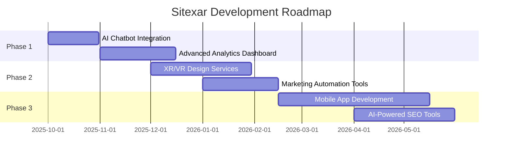

<div align="center">

```
   _____ _ _                        
  / ____(_) |                       
 | (___  _| |_ _____  ____ _ _ __  
  \___ \| | __/ _ \ \/ / _` | '__| 
  ____) | | ||  __/>  < (_| | |    
 |_____/|_|\__\___/_/\_\__,_|_|    
                                    
    🌌 Next-Gen Digital Solutions 🌌
```


[](https://github.com/Rajath2005/Sitexar)
[](LICENSE)
[](https://www.typescriptlang.org/)
[](https://reactjs.org/)
[](https://vitejs.dev/)

**🚀 Cutting-edge web development, SEO, and digital marketing company**

[🌐 Visit Website](https://rajath2005.github.io/Sitexar/) • [📖 Documentation](#quick-start) • [🤝 Contribute](#contribution-guide) • [⭐ Star Us](https://github.com/Rajath2005/Sitexar)

</div>

---

## ⚡ About Sitexar

**Sitexar** is a next-generation digital solutions company specializing in transforming visions into reality. We combine cutting-edge technology with creative excellence to deliver exceptional web experiences, powerful SEO strategies, innovative digital marketing campaigns, and stunning UI/UX designs.

> 💡 **Mission**: Empowering businesses with digital solutions that drive growth and innovation in the modern web ecosystem.

<br>

```ascii
╔══════════════════════════════════════════════════════════════╗
║  🌟 Web Development  |  📈 SEO Optimization  |  🎨 UI/UX   ║
║  💼 Digital Marketing | 🤖 AI Integration    |  🚀 Growth   ║
╚══════════════════════════════════════════════════════════════╝
```

---

## 🛠️ Tech Stack

<div align="center">

| Technology | Description | Version |
|:----------:|:------------|:-------:|
|  | **Vite** - Lightning-fast build tool | 5.0+ |
|  | **TypeScript** - Type-safe JavaScript | 5.0+ |
|  | **React** - UI Component Library | 18+ |
|  | **Tailwind CSS** - Utility-first CSS | 3.0+ |
|  | **shadcn/ui** - Beautiful components | Latest |

</div>

<div align="center">

```typescript
const techStack = {
  frontend: ["React", "TypeScript", "Tailwind CSS"],
  styling: ["shadcn/ui", "Radix UI"],
  buildTool: "Vite",
  deployment: "GitHub Pages",
  performance: "⚡ Blazing Fast"
};
```

</div>

---

## ✨ Features

<table>
<tr>
<td width="50%">

### 🌐 Web Development
- ⚡ Lightning-fast React applications
- 🎯 Responsive & mobile-first design
- 🔒 Secure & scalable architecture
- 🎨 Modern UI components with shadcn/ui
- ♿ Accessibility-focused (WCAG compliant)

</td>
<td width="50%">

### 📈 SEO Optimization
- 🔍 Advanced keyword research
- 📊 Technical SEO audits
- 🚀 Performance optimization
- 📱 Mobile-first indexing
- 📈 Analytics & reporting

</td>
</tr>
<tr>
<td width="50%">

### 💼 Digital Marketing
- 🎯 Targeted campaign strategies
- 📱 Social media management
- 📧 Email marketing automation
- 💰 PPC & ad management
- 📊 Data-driven insights

</td>
<td width="50%">

### 🎨 UI/UX Design
- 🖼️ Stunning visual designs
- 🧭 Intuitive user experiences
- 🎭 Brand identity creation
- 📐 Wireframing & prototyping
- 🔄 Iterative design process

</td>
</tr>
</table>

---

## 🚀 Quick Start

Get started with Sitexar in minutes! Follow these simple steps:

### Prerequisites

```bash
node >= 18.0.0
npm >= 9.0.0
```

### Installation

```bash
# 1️⃣ Clone the repository
git clone https://github.com/Rajath2005/Sitexar.git

# 2️⃣ Navigate to project directory
cd Sitexar

# 3️⃣ Install dependencies
npm install

# 4️⃣ Start development server
npm run dev

# 5️⃣ Build for production
npm run build

# 6️⃣ Preview production build
npm run preview
```

### 🎯 Quick Commands

| Command | Description |
|---------|-------------|
| `npm run dev` | 🔥 Start development server at `localhost:5173` |
| `npm run build` | 📦 Build optimized production bundle |
| `npm run preview` | 👀 Preview production build locally |
| `npm run lint` | 🔍 Lint code with ESLint |
| `npm run deploy` | 🚀 Deploy to GitHub Pages |

---

## 👥 Meet Our Team

<div align="center">

### 🌟 The Innovators Behind Sitexar

<table>
<tr>
<td align="center" width="33%">
<br>
<b>🚀 Rajath</b><br>
<sub>Lead Developer</sub><br>
<a href="https://github.com/Rajath2005">

</a>
</td>
<td align="center" width="33%">
<br>
<b>⚡ Team Member 2</b><br>
<sub>UI/UX Designer</sub><br>
<a href="https://github.com">

</a>
</td>
<td align="center" width="33%">
<br>
<b>🎨 Team Member 3</b><br>
<sub>SEO Specialist</sub><br>
<a href="https://github.com">

</a>
</td>
</tr>
<tr>
<td align="center" width="33%">
<br>
<b>💼 Team Member 4</b><br>
<sub>Marketing Lead</sub><br>
<a href="https://github.com">

</a>
</td>
<td align="center" width="33%">
<br>
<b>🔧 Team Member 5</b><br>
<sub>Backend Engineer</sub><br>
<a href="https://github.com">

</a>
</td>
<td align="center" width="33%">
<br>
<b>📊 Team Member 6</b><br>
<sub>Data Analyst</sub><br>
<a href="https://github.com">

</a>
</td>
</tr>
</table>

</div>

---

## 🗺️ Roadmap

### 🎯 Current Focus

- [x] ✅ Modern responsive website
- [x] ✅ SEO optimization
- [x] ✅ Performance optimization
- [x] ✅ Accessibility improvements

### 🚀 Coming Soon



### 🌟 Future Innovations

| Feature | Description | Status |
|---------|-------------|--------|
| 🤖 **AI Integration** | Smart chatbots & content generation | 🔄 In Progress |
| 🥽 **XR/VR Design** | Immersive 3D experiences | 📋 Planned |
| 🔄 **Automation Suite** | Marketing & deployment automation | 📋 Planned |
| 📱 **Mobile Apps** | Native iOS & Android development | 🔮 Future |
| 🧠 **ML Analytics** | Predictive analytics & insights | 🔮 Future |
| 🌐 **Web3 Solutions** | Blockchain & decentralized apps | 🔮 Future |

---

## 🤝 Contribution Guide

We welcome contributions from the community! Here's how you can help:

### 📝 How to Contribute

1. **Fork the repository**
   ```bash
   git clone https://github.com/YOUR_USERNAME/Sitexar.git
   ```

2. **Create a feature branch**
   ```bash
   git checkout -b feature/amazing-feature
   ```

3. **Make your changes**
   - Write clean, documented code
   - Follow our coding standards
   - Add tests if applicable

4. **Commit your changes**
   ```bash
   git commit -m "✨ Add amazing feature"
   ```

5. **Push to your branch**
   ```bash
   git push origin feature/amazing-feature
   ```

6. **Open a Pull Request**
   - Provide a clear description
   - Reference any related issues
   - Wait for review from maintainers

### 📋 PR Guidelines

- ✅ Follow the existing code style
- ✅ Write meaningful commit messages
- ✅ Update documentation if needed
- ✅ Test your changes thoroughly
- ✅ Keep PRs focused and atomic

### 🐛 Found a Bug?

Open an issue with:
- Clear description of the bug
- Steps to reproduce
- Expected vs actual behavior
- Screenshots if applicable

---

## 📄 License

<div align="center">

```
MIT License

Copyright (c) 2025 Sitexar

Permission is hereby granted, free of charge, to any person obtaining a copy
of this software and associated documentation files (the "Software"), to deal
in the Software without restriction, including without limitation the rights
to use, copy, modify, merge, publish, distribute, sublicense, and/or sell
copies of the Software, and to permit persons to whom the Software is
furnished to do so, subject to the following conditions:

The above copyright notice and this permission notice shall be included in all
copies or substantial portions of the Software.

THE SOFTWARE IS PROVIDED "AS IS", WITHOUT WARRANTY OF ANY KIND.
```

[](https://opensource.org/licenses/MIT)

</div>

---

## 📬 Connect With Us

<div align="center">

[](https://rajath2005.github.io/Sitexar/)
[](https://github.com/Rajath2005/Sitexar)
[](mailto:contact@sitexar.com)

### ⭐ If you like what we do, give us a star!


**Made with 💙 by the Sitexar Team**

</div>
